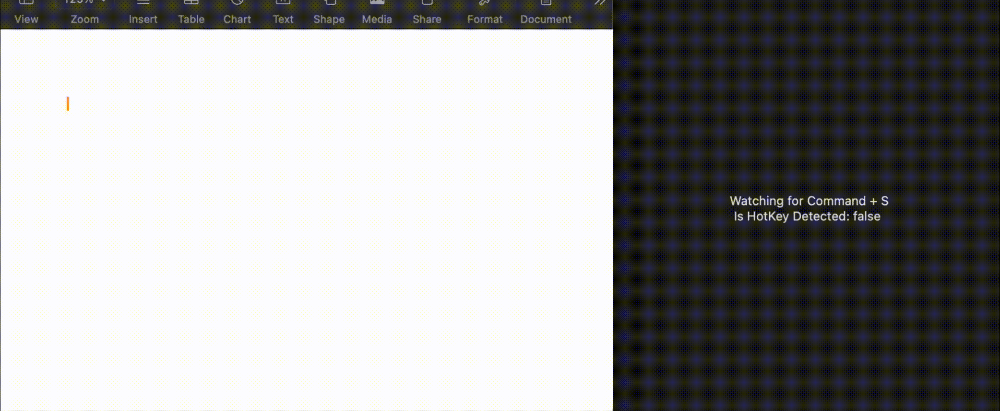

# SwiftUI_GlobalHotKeyDemo

A demo of listening To Global Key Events on MacOS with two different approaches.

For more details, please refer to my blog [SwiftUI/MacOS: Detect/Listen To Global Key Events Two Ways!](https://medium.com/p/swiftui-macos-detect-listen-to-global-key-events-two-ways-df19e565793d)

### With NSEvent Global Montior

### With CGEvent Tap

